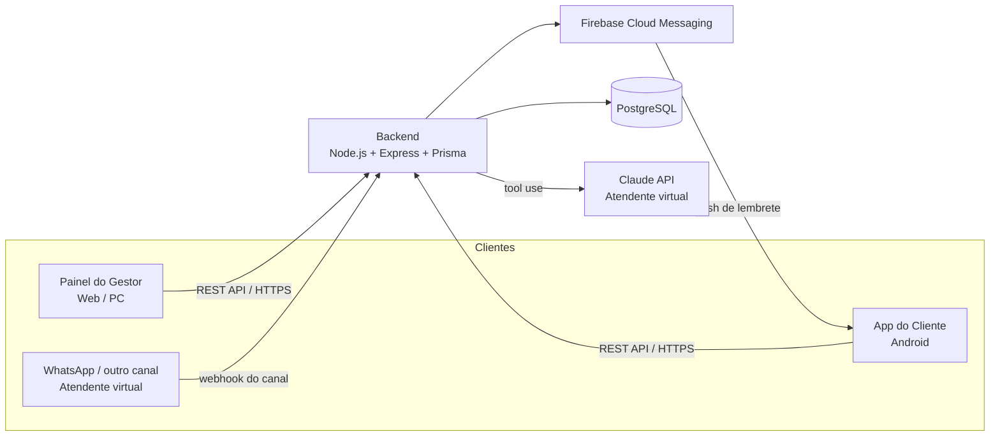
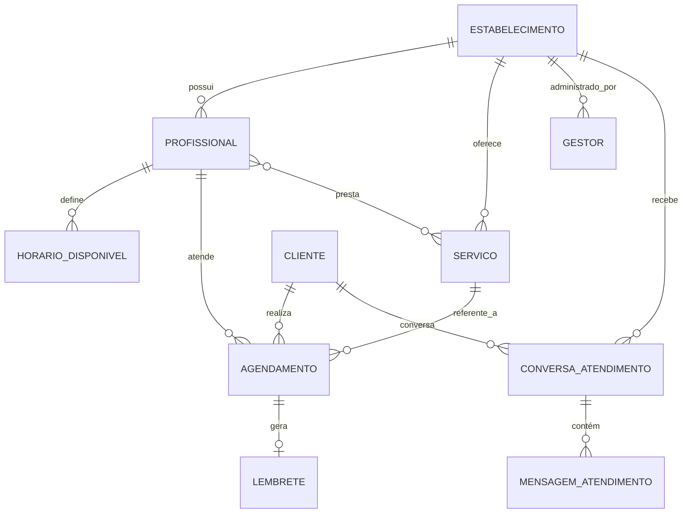
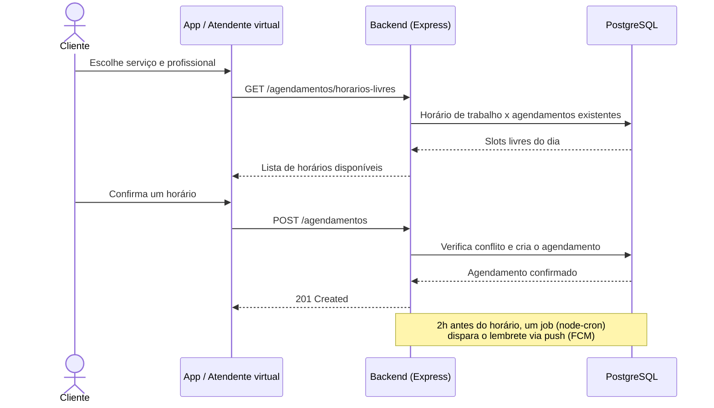
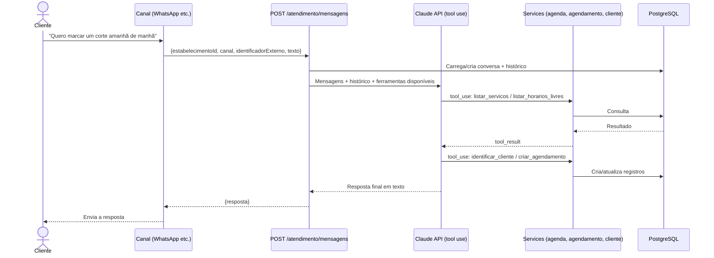

# Agendador de Horários

Sistema de agendamento online para salões e barbearias. O cliente marca o próprio horário pelo app, sem depender de telefone ou WhatsApp com a recepção; o gestor acompanha e configura tudo pelo painel web.


Documentação técnica original (plano de fases completo): [docs/](docs/).

## Índice

- [Visão geral](#visão-geral)
- [Arquitetura](#arquitetura)
- [Modelo de dados](#modelo-de-dados)
- [Fluxo de agendamento](#fluxo-de-agendamento)
- [Atendente virtual](#atendente-virtual)
- [Estrutura do projeto](#estrutura-do-projeto)
- [Como rodar localmente](#como-rodar-localmente)
- [Principais endpoints da API](#principais-endpoints-da-api)
- [Status da implementação](#status-da-implementação)
- [Próximos passos sugeridos](#próximos-passos-sugeridos)

## Visão geral

**Duas frentes de uso:**

| Frente | Quem usa | Onde roda | Pasta |
| --- | --- | --- | --- |
| Painel do Gestor | Dono/gerente do estabelecimento | Navegador (PC) | `painel-gestor/` |
| App do Cliente | Cliente final | Celular (Android, a construir) | consome a mesma API |
| Atendente virtual | Cliente final, por texto | WhatsApp ou outro canal de chat | `backend/src/modules/atendimento/` |

Todos os clientes são *stateless* em relação à agenda — a verdade fica sempre no backend, evitando conflito de horário entre o que o gestor vê e o que o cliente vê.

## Arquitetura



## Modelo de dados



Todas as entidades estão definidas em [`backend/prisma/schema.prisma`](backend/prisma/schema.prisma), com migrations geradas pelo Prisma.

## Fluxo de agendamento

Como o cliente marca um horário (pelo App ou pelo atendente virtual) — o backend sempre recalcula os horários livres na hora, então nunca mostra um slot que já foi ocupado por outra pessoa entre a consulta e a confirmação:



## Atendente virtual

O backend tem um módulo de atendimento (`backend/src/modules/atendimento/`) que expõe `POST /atendimento/mensagens` e usa a **Claude API com tool use** para conversar com o cliente, consultar a agenda e criar/cancelar agendamentos — sem depender de n8n ou de qualquer outro serviço externo rodando à parte.



**Ferramentas disponíveis para o assistente:** `listar_servicos`, `listar_profissionais`, `listar_horarios_livres`, `identificar_cliente`, `criar_agendamento`, `listar_meus_agendamentos`, `cancelar_agendamento` — todas reaproveitando os mesmos services usados pelo Painel e pelo App (ver [`ferramentas.ts`](backend/src/modules/atendimento/ferramentas.ts)).

O endpoint é **agnóstico de canal**: não sabe nada sobre WhatsApp especificamente. Para ligar a um canal real falta só um pequeno adaptador (rota de webhook) que traduza o payload do canal para o formato acima e envie a `resposta` de volta pela API do canal:

| Canal | Como plugar |
| --- | --- |
| WhatsApp Cloud API (oficial) | Webhook recebe `{ from, text }` → chama `/atendimento/mensagens` com `canal: "WHATSAPP"`, `identificadorExterno: from` → responde via `POST` na Graph API da Meta |
| Baileys (não-oficial) | Mesmo fluxo, trocando o envio pela função de envio do Baileys |

Sem `ANTHROPIC_API_KEY` configurada, o módulo responde `503` e o resto da API funciona normalmente.

## Estrutura do projeto

```
agendador-horarios/
├─ backend/                     API REST (Node.js + Express + Prisma)
│  ├─ src/modules/
│  │  ├─ auth/                  login/registro de gestor e cliente (JWT)
│  │  ├─ estabelecimento/       configurações do estabelecimento
│  │  ├─ profissional/          CRUD de profissionais + horários de trabalho
│  │  ├─ servico/                CRUD de serviços
│  │  ├─ agendamento/           motor de horários livres + CRUD de agendamentos
│  │  ├─ cliente/                perfil e listagem de clientes
│  │  ├─ atendimento/           atendente virtual (Claude API + tool use)
│  │  └─ notificacao/            job de lembretes (node-cron) + push (FCM)
│  └─ prisma/schema.prisma       modelo de dados completo
├─ painel-gestor/                Painel web (React + Vite)
│  └─ src/pages/                 Login, Dashboard, Agenda, Serviços, Profissionais, Clientes, Configurações
├─ docker-compose.yml            PostgreSQL + backend
└─ docs/                         documentação técnica original do projeto
```

**App Android:** projeto separado, aberto no Android Studio (ainda não iniciado — ver [Status da implementação](#status-da-implementação)).

## Como rodar localmente

### 1. Banco de dados + backend (via Docker)

```bash
docker compose up -d postgres
cd backend
cp .env.example .env
npm install
npm run prisma:migrate
npm run dev
```

Backend disponível em `http://localhost:3333` (`GET /health` para checar).

### 2. Painel do gestor

```bash
cd painel-gestor
cp .env.example .env
npm install
npm run dev
```

Painel disponível em `http://localhost:5173`.

### 3. Primeiro acesso

Acesse `http://localhost:5173/registro` para criar o primeiro estabelecimento e usuário gestor. Depois, cadastre serviços e profissionais para que a agenda comece a ter horários livres.

## Principais endpoints da API

| Método | Rota | Quem acessa | Descrição |
| --- | --- | --- | --- |
| POST | `/auth/gestor/registrar` · `/auth/gestor/login` | Gestor | Cria estabelecimento + conta do gestor / login |
| POST | `/auth/cliente/registrar` · `/auth/cliente/login` | Cliente | Cadastro / login do cliente final |
| GET/PUT | `/estabelecimentos/me` | Gestor | Configurações do estabelecimento |
| GET/POST/PUT/DELETE | `/servicos` | Gestor (escrita) / público (leitura) | CRUD de serviços |
| GET/POST/PUT/DELETE | `/profissionais` | Gestor (escrita) / público (leitura) | CRUD de profissionais, serviços e horários |
| GET | `/agendamentos/horarios-livres` | Público | Slots livres de um profissional/serviço numa data |
| POST/GET/DELETE | `/agendamentos` | Cliente | Criar, listar ("meus") e cancelar agendamento |
| GET/POST/DELETE | `/agendamentos` (`/manual`, `/:id/gestor`) | Gestor | Ver agenda do dia, criar manual, cancelar |
| GET | `/clientes` | Gestor | Clientes com histórico de agendamentos |
| POST | `/atendimento/mensagens` | Canal do atendente virtual | Envia a mensagem do cliente e recebe a resposta do assistente |

## Status da implementação

| Fase | Entregável | Status |
| --- | --- | --- |
| 1 | Base do backend (API, Prisma, JWT do gestor) | ✅ |
| 2 | Painel — cadastros de Serviços e Profissionais | ✅ |
| 3 | Motor de agenda (`GET /agendamentos/horarios-livres`) | ✅ |
| 4 | Painel — tela de Agenda (visualização + criação/cancelamento manual) | ✅ |
| 5 | API do cliente (registro/login, listar, criar/cancelar agendamento) | ✅ |
| 6 | App Android (MVP) | ⬜ não iniciado — projeto separado, a criar no Android Studio |
| 7 | Lembretes automáticos | 🟡 job pronto; integração real com Firebase Cloud Messaging pendente |
| 8 | Testes e ajustes ponta a ponta | ⬜ |
| 9 | Deploy em produção (VPS Oracle Cloud) | ⬜ |
| 10 | Distribuição do APK | ⬜ |
| Extra | Atendente virtual via Claude API | 🟡 backend pronto; falta plugar o canal (WhatsApp etc.) |

## Próximos passos sugeridos

1. No servidor: `docker compose up -d` (backend + Postgres) e `docker compose exec backend npm run prisma:migrate` para criar as tabelas.
2. Testar o fluxo ponta a ponta pelo Painel (registro → serviços → profissionais → agenda).
3. Iniciar o projeto Android separado (`agendador-app-android/`) na Fase 6, consumindo os endpoints já disponíveis em `backend/src/modules/agendamento` e `backend/src/modules/auth`.
4. Substituir o stub de `push.service.ts` pela integração real com Firebase Admin SDK.
5. Decidir o canal do atendente virtual (WhatsApp Cloud API oficial x não-oficial) e escrever o adaptador de webhook correspondente.
